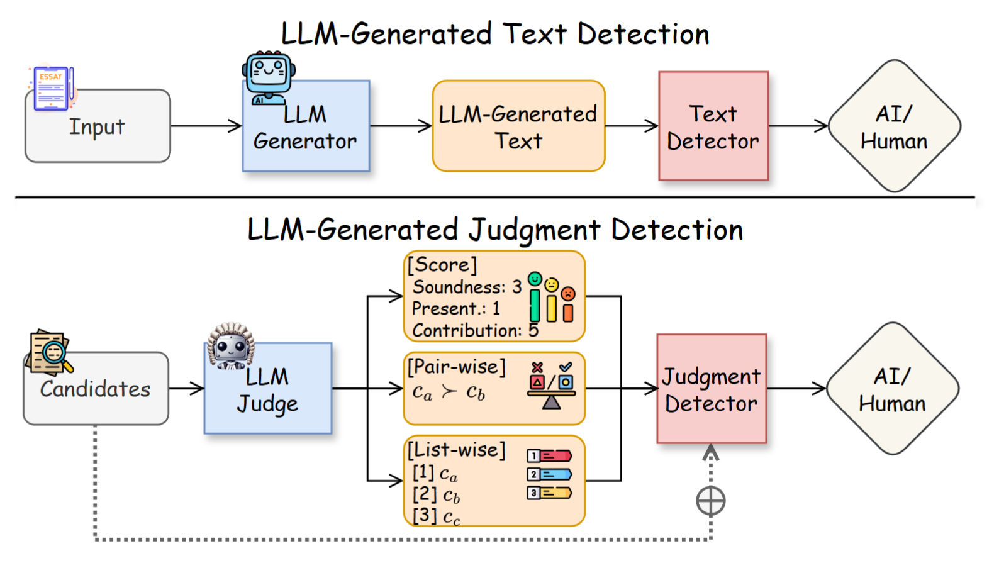
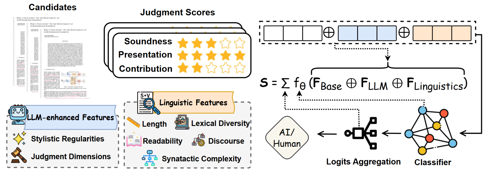

# Who’s Your Judge? On the Detectability of LLM-Generated Judgments

[](https://arxiv.org/abs/2509.25154) []() [](https://huggingface.co/papers/2509.25154)

This repository contains the official Python implementation of the framework described in the paper **"Who’s Your Judge? On the Detectability of LLM-Generated Judgments."**

## News

- **[09/29/2025]** Our paper is available on [arXiv](https://arxiv.org/abs/2509.25154).
- **[09/29/2025]** Our dataset is available on [huggingface](https://huggingface.co/datasets/wjldw/JD-Bench).
- **[09/29/2025]** GitHub repository created. Code release is coming soon.

## Introduction

Large Language Model (LLM)-based judgments leverage powerful LLMs to efficiently evaluate candidate content and provide judgment scores. However, the inherent biases and vulnerabilities of LLM-generated judgments raise concerns, underscoring the urgent need for distinguishing them in sensitive scenarios like academic peer reviewing. In this work, we propose and formalize the task of **judgment detection** and systematically investigate the detectability of LLM-generated judgments. Unlike LLM-generated text detection, judgment detection relies solely on judgment scores and candidates, reflecting real-world scenarios where textual feedback is often unavailable in the detection process. Our preliminary analysis shows that existing LLM-generated text detection methods perform poorly given their incapability to capture the interaction between judgment scores and candidate content-an aspect crucial for effective judgment detection. Inspired by this, we introduce **J-Detector**, a lightweight and transparent neural detector augmented with explicitly extracted linguistic and LLM-enhanced features to link LLM judges' biases with candidates' properties for accurate detection. Experiments across diverse datasets demonstrate the effectiveness of J-Detector and show how its interpretability enables quantifying biases in LLM judges. Finally, we analyze key factors affecting the detectability of LLM-generated judgments and validate the practical utility of judgment detection in real-world scenarios.

<p align="center">
  <br>
  <em>Figure 1:</em> Comparison between LLM-generated judgment detection and text detection.
</p>


## Contribution

⭐ **Novel task.** We propose, for the first time, the judgment detection task, which aims at distinguishing human and LLM judgments based on judgment scores and candidate content.

⭐ **Effective approach.** We design J-Detector, a lightweight and interpretable detection method, that effectively bridges candidate and judgment information with linguistic and LLM-enhanced features.

⭐ **Empirical validation.** Through extensive experiments, we demonstrate the advantages of \textit{J-Detector}, identify key factors driving judgment detectability, and show the utility of judgment detection in real-world applications.


<p align="center">
  <br>
  <em>Figure 2:</em> J-Detector framework.
</p>

## Citation

If our repo helped you out, we'd love it if you gave us a citation! Thanks for supporting our work!

```tex

```